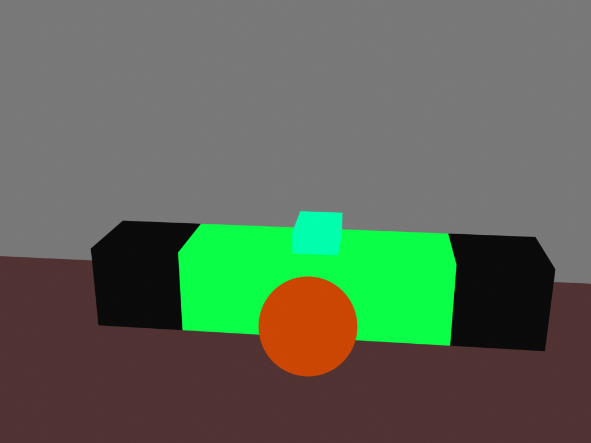

# cse599-project
This repository has code and data for our course project, World Modeling with Language Models.

## Structure
- `data` contains 15 generations with their prompts, generated Blender scripts,
final renders from our pipeline, and renders using plain Stable Diffusion on the prompt.
- `eval-data` contains the shuffled pairs of images we used for our human evaluation.
- `chatgpt-prompt.txt` has the template we used for prompting ChatGPT.
- `generate_prompts.py` generates prompts for ChatGPT and Stable Diffusion from an environment prompt.
- `generate_script.py` generates a full Blender script from a ChatGPT completion of a function for filling in environment details.
- `script.py` has the template we use for creating 3D scenes and segmentation map renders in Blender.
- `sd-prompts.txt` has alternative prompts and parameter details.
- `shuffle.py` creates shuffled pairs for our human evaluation and outputs the shuffled labels.

## Installation/Prequisites
1. Get ChatGPT Plus (for access to GPT-4).
2. Install Blender 3.5.1.
3. Install Stable Diffusion. We used https://github.com/AUTOMATIC1111/stable-diffusion-webui
with Stable Diffusion v1.5 (v1-5-pruned-emaonly.ckpt from https://huggingface.co/runwayml/stable-diffusion-v1-5).
4. Install the ControlNet plugin for Stable Diffusion. In stable-diffusion-webui,
this just requires adding a plugin in the GUI. We used the default ControlNet models
from https://huggingface.co/lllyasviel/ControlNet/tree/main/models.

## Running
1. Run `python generate_prompts.py <environment prompt>`, which outputs a prompt meant for
the language model and a prompt meant for Stable Diffusion.
2. Prompt ChatGPT (set to GPT-4) with the ChatGPT prompt from step 1.
The important output is the code block with the `fill_room` function;
you might have to click "Continue generating" to get the full completion.
3. Run `python generate_script.py <fill_room>` with the entirety of the
completed `fill_room` function as an argument. This outputs a script to be used in Blender.
4. Create a new Blender project. Under scripting, create a new script and paste the
script generated in step 3. Run the script.

We now have a 3D scene of an environment generated from our original prompt.
Now, we can get a detailed render using Stable Diffusion.

5. We need to get a segmentation map from the scene.
Adjust the camera's position and orientation in Blender.
When ready, render an image and save the result. It should look something like this:

6. To prepare Stable Diffusion, set the following parameters:
    - Sampling method: DPM++ 2M Karras
    - Sampling steps: 25
    - Width: 1024
    - Height: 768
    - CFG Scale: 10
    - ControlNet Model: control_v11p_sd15_seg [e1f51eb9]
    - ControlNet Control Weight: 0.7
7. Set the ControlNet image to the image from step 5 and the Stable Diffusion
prompt to the prompt from step 1. Press generate.

Now, we have a detailed render:
